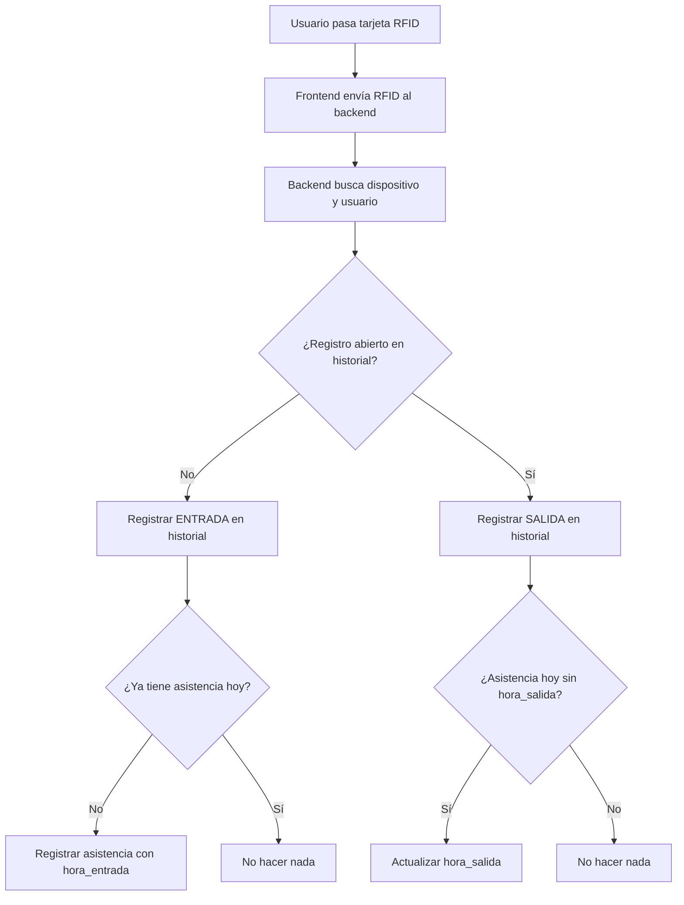

# 📚 Documentación Completa: Integración de Asistencia Automática por RFID

---

## 1. Estructura de la Base de Datos

### Tabla: `asistencia`
- **id**: Identificador único (PK)
- **id_usuario**: Usuario al que pertenece la asistencia
- **id_ficha**: Ficha del usuario
- **fecha**: Fecha de la asistencia (tipo `date`)
- **hora_entrada**: Hora exacta de entrada (tipo `timestamp`)
- **hora_salida**: Hora exacta de salida (tipo `timestamp`)
- **tipo**: Forma de registro (`rfid`, `manual`, etc)
- **estado**: Estado de la asistencia (`presente`, `ausente`, etc)

### Tabla: `dispositivo`
- **id**: Identificador único
- **rfid**: Código RFID único asignado al dispositivo
- **id_usuario**: Usuario dueño del dispositivo

### Tabla: `historial_dispositivo`
- **id_historial**: Identificador único
- **id_dispositivo**: Dispositivo involucrado
- **fecha_hora_entrada**: Timestamp de entrada
- **fecha_hora_salida**: Timestamp de salida
- **descripcion**: Descripción del evento

---

## 2. Endpoints Backend

### POST `/api/dispositivos/acceso-rfid`
- **Función:** Registrar acceso por RFID (entrada/salida) y asistencia automática.
- **Flujo detallado:**
  1. **El frontend envía el RFID** al backend cuando el usuario pasa la tarjeta.
  2. **El backend busca el dispositivo** con ese RFID y el usuario asociado.
  3. **Valida que el usuario esté activo.**
  4. **Alternancia ENTRADA/SALIDA:**
     - **ENTRADA:**
       - Registra evento en `historial_dispositivo` (marca la entrada).
       - Si el usuario tiene ficha y no tiene asistencia para hoy, **crea un registro en `asistencia`** con la hora de entrada.
     - **SALIDA:**
       - Actualiza evento en `historial_dispositivo` (marca la salida).
       - Si existe asistencia para hoy y no tiene hora de salida, **actualiza el campo `hora_salida`**.
  5. **Devuelve** los datos del usuario, dispositivo, tipo de evento y mensaje.

#### Fragmento de código relevante:
```js
if (registroAbiertoRes.rows.length === 0) {
  // ENTRADA
  await pool.query(
    'INSERT INTO historial_dispositivo ...'
  );
  if (usuario.id_ficha) {
    const hoy = new Date().toISOString().slice(0, 10);
    const ahora = new Date();
    const existe = await pool.query(
      'SELECT 1 FROM asistencia WHERE id_usuario = $1 AND fecha = $2',
      [usuario.id, hoy]
    );
    if (existe.rows.length === 0) {
      await pool.query(
        'INSERT INTO asistencia (id_usuario, id_ficha, fecha, hora_entrada, estado, tipo) VALUES ($1, $2, $3, $4, $5, $6)',
        [usuario.id, usuario.id_ficha, hoy, ahora, 'presente', 'rfid']
      );
    }
  }
} else {
  // SALIDA
  await pool.query(
    'UPDATE historial_dispositivo ...'
  );
  if (usuario.id_ficha) {
    const hoy = new Date().toISOString().slice(0, 10);
    const ahora = new Date();
    const asistenciaHoy = await pool.query(
      'SELECT id FROM asistencia WHERE id_usuario = $1 AND fecha = $2 AND hora_salida IS NULL',
      [usuario.id, hoy]
    );
    if (asistenciaHoy.rows.length > 0) {
      await pool.query(
        'UPDATE asistencia SET hora_salida = $1 WHERE id = $2',
        [ahora, asistenciaHoy.rows[0].id]
      );
    }
  }
}
```

---

## 3. Integración Frontend

### Pantalla de Acceso RFID
- El usuario pasa la tarjeta RFID en la pantalla de acceso.
- El frontend envía el código RFID al endpoint `/api/dispositivos/acceso-rfid` mediante un POST.
- El backend responde con los datos del usuario, dispositivo, tipo de evento y mensaje.
- El frontend muestra la información y confirma el registro.

#### Fragmento relevante (AccessControl.jsx):
```js
const handleSubmit = async (e) => {
  e.preventDefault();
  if (!rfid) return;
  try {
    const res = await api.post('/api/dispositivos/acceso-rfid', { rfid });
    setData(res.data);
    // Muestra mensaje de éxito
  } catch (err) {
    // Maneja errores
  }
};
```

---

## 4. Lógica de Alternancia ENTRADA/SALIDA (Explicación paso a paso)

### ¿Qué pasa cuando el usuario pasa la tarjeta?

1. **El usuario pasa la tarjeta por el lector RFID.**
2. **El frontend envía el código RFID al backend.**
3. **El backend busca el dispositivo y el usuario asociado.**
4. **El backend revisa si hay un registro abierto en `historial_dispositivo` para ese dispositivo:**
   - **Si NO hay registro abierto:**
     - Se registra una ENTRADA en `historial_dispositivo`.
     - Se verifica si el usuario ya tiene asistencia para hoy:
       - **Si NO tiene:** Se crea un registro en `asistencia` con la hora de entrada.
       - **Si YA tiene:** No se crea otro registro (evita duplicados).
   - **Si SÍ hay registro abierto:**
     - Se registra una SALIDA en `historial_dispositivo` (actualiza el registro abierto).
     - Se verifica si el usuario tiene asistencia para hoy y no tiene hora de salida:
       - **Si cumple:** Se actualiza el campo `hora_salida` con la hora actual.
       - **Si no:** No se hace nada (ya tiene salida registrada).

### ¿Qué pasa si el usuario no pasa la tarjeta?
- No se crea ni actualiza ningún registro de asistencia para ese usuario ese día.
- Los campos de hora quedan en `NULL` (puedes identificar quién no usó el lector).

---

## 5. Ejemplo de Flujo Completo

### Caso 1: Usuario pasa la tarjeta por primera vez en el día
- Se crea un registro en `historial_dispositivo` (entrada).
- Se crea un registro en `asistencia` con la hora de entrada.

### Caso 2: Usuario pasa la tarjeta por segunda vez en el día
- Se actualiza el registro en `historial_dispositivo` (salida).
- Se actualiza el registro en `asistencia` con la hora de salida.

### Caso 3: Usuario no pasa la tarjeta
- No se crea ni actualiza asistencia.
- Si se marca asistencia manual, los campos de hora pueden quedar en `NULL`.

---

## 6. SQL Útil para Pruebas

- **Eliminar asistencia de hoy para un usuario:**
  ```sql
  DELETE FROM asistencia WHERE id_usuario = 88 AND fecha = CURRENT_DATE;
  ```

- **Ver asistencia de hoy para un usuario:**
  ```sql
  SELECT * FROM asistencia WHERE id_usuario = 88 AND fecha = CURRENT_DATE;
  ```

---

## 7. Recomendaciones y Buenas Prácticas

- Valida siempre que el usuario esté activo antes de registrar asistencia.
- Asegúrate de que los campos `hora_entrada` y `hora_salida` permitan valores tipo `timestamp`.
- El frontend solo envía el RFID, el backend se encarga de toda la lógica.
- Para pruebas, elimina el registro de asistencia del día antes de probar la lógica nueva.
- Puedes usar los campos de hora para reportes de puntualidad y control de acceso.

---

## 8. Resumen Visual del Flujo



---

## 9. ¿Qué más puedes hacer?
- Mostrar la hora de entrada/salida en el frontend.
- Generar reportes de puntualidad.
- Notificar al usuario/admin si no se registró asistencia.

---

**¡Cualquier duda, revisa este README o pregunta!**

---

# 10. Proceso Completo de Importación y Gestión de Asistencia

## 10.1. Importación de Aprendices y Relación con Fichas

### a) ¿Por qué importar aprendices?
- Para que el sistema tenga la lista de todos los aprendices de una ficha (grupo) y pueda tomar asistencia correctamente.

### b) ¿Cómo se importan los aprendices?
- El admin puede importar aprendices desde un archivo Excel, CSV o desde un sistema externo (por ejemplo, Sofía Plus).
- El script o endpoint de importación inserta los aprendices en la tabla `usuario` y los asocia a la ficha correspondiente (`id_ficha`).

#### Ejemplo de importación (SQL):
```sql
INSERT INTO usuario (nombre, documento, correo, rol, id_ficha, id_programa, estado)
VALUES ('Juan Pérez', '123456789', 'juan.perez@sena.edu.co', 'aprendiz', 2825019, 1, 'activo');
```

#### Ejemplo de importación (JS/Node):
```js
// importar_aprendices.js
const aprendices = [
  { nombre: 'Juan Pérez', documento: '123456789', correo: 'juan.perez@sena.edu.co', id_ficha: 2825019, id_programa: 1 },
  // ...
];
for (const a of aprendices) {
  await pool.query(
    'INSERT INTO usuario (nombre, documento, correo, rol, id_ficha, id_programa, estado) VALUES ($1, $2, $3, $4, $5, $6, $7)',
    [a.nombre, a.documento, a.correo, 'aprendiz', a.id_ficha, a.id_programa, 'activo']
  );
}
```

### c) Relación con la tabla `ficha`
- Cada aprendiz tiene un campo `id_ficha` que lo asocia a una ficha (grupo).
- La tabla `ficha` contiene los datos de cada grupo (código, nombre, etc).

---

## 10.2. Asignación de Fichas a Instructores

### a) Tabla intermedia `instructor_ficha`
- Permite asociar uno o varios instructores a una ficha.
- Estructura:
  - `id` (PK)
  - `id_instructor` (FK a usuario)
  - `id_ficha` (FK a ficha)

### b) Asignación manual (SQL):
```sql
INSERT INTO instructor_ficha (id_instructor, id_ficha) VALUES (ID_INSTRUCTOR, 2825019);
```

### c) ¿Qué logra esto?
- El instructor solo puede ver y tomar asistencia de las fichas que tiene asignadas.
- Permite control y seguridad en la gestión de grupos.

---

## 10.3. Flujo de Toma de Asistencia Integrado

### a) El instructor inicia sesión
- El sistema detecta su rol y consulta las fichas asignadas en `instructor_ficha`.
- El instructor solo ve los aprendices de sus fichas.

### b) Visualización de aprendices y estado de asistencia
- El frontend consulta al backend la lista de aprendices de la ficha y la asistencia del día.
- Muestra el estado: "Presente", "Ausente" o "Sin marcar".

### c) Registro de asistencia
- **Automático:** Si el aprendiz pasa la tarjeta RFID, el sistema marca asistencia automáticamente.
- **Manual:** El instructor puede marcar "Presente" o "Ausente" desde la interfaz.
- **Edición:** El instructor puede editar el estado si es necesario.

### d) Ejemplo de endpoints usados
- `GET /api/asistencia/aprendices/:id_instructor` — Lista los aprendices de las fichas asignadas al instructor.
- `GET /api/asistencia/por-ficha-fecha?id_ficha=2825019&fecha=2025-06-21` — Trae la asistencia de la ficha para el día.
- `POST /api/asistencia` — Marca o edita la asistencia de un aprendiz.

### e) Ejemplo de flujo visual
1. **Admin importa aprendices y asigna ficha a instructor.**
2. **Instructor inicia sesión y ve solo su ficha y aprendices.**
3. **Aprendiz pasa la tarjeta o el instructor marca manualmente.**
4. **El sistema registra la asistencia y la muestra en tiempo real.**

---

## 10.4. Resumen de Integración
- **Importación:** Aprendices se cargan y se asocian a una ficha.
- **Asignación:** Admin asigna fichas a instructores (tabla `instructor_ficha`).
- **Visualización:** Instructor solo ve y gestiona sus fichas y aprendices.
- **Toma de asistencia:** Automática (RFID) o manual (botones en el frontend).
- **Todo queda registrado y controlado en la base de datos.**

---

## 10.5. SQL y comandos útiles

- **Importar aprendiz:**
  ```sql
  INSERT INTO usuario (nombre, documento, correo, rol, id_ficha, id_programa, estado)
  VALUES ('Ana Gómez', '987654321', 'ana.gomez@sena.edu.co', 'aprendiz', 2825019, 1, 'activo');
  ```
- **Asignar ficha a instructor:**
  ```sql
  INSERT INTO instructor_ficha (id_instructor, id_ficha) VALUES (12, 2825019);
  ```
- **Ver aprendices de una ficha:**
  ```sql
  SELECT * FROM usuario WHERE id_ficha = 2825019;
  ```
- **Ver fichas de un instructor:**
  ```sql
  SELECT f.* FROM ficha f JOIN instructor_ficha i ON f.id_ficha = i.id_ficha WHERE i.id_instructor = 12;
  ```

---

# 11. Ejemplo de caso real

1. **El admin importa los aprendices de la ficha 2825019.**
2. **El admin asigna la ficha 2825019 al instructor Juan.**
3. **Juan inicia sesión y ve solo la ficha 2825019 y sus aprendices.**
4. **Cada día, los aprendices pasan la tarjeta o Juan marca la asistencia manualmente.**
5. **El sistema registra y muestra la asistencia en tiempo real.**

---

# 12. Recomendaciones finales
- Documenta el proceso de importación y asignación para otros admins.
- Haz respaldos antes de importar o asignar masivamente.
- Usa la interfaz gráfica para evitar errores de SQL (si la tienes).
- Mantén la base de datos limpia y actualizada.

--- 