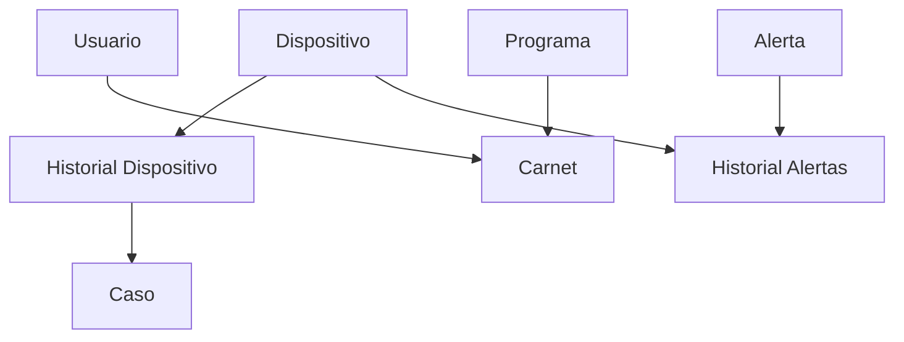

# CompuSCan - Sistema de Control y Gestión

## Descripción
CompuSCan es un sistema de gestión y control diseñado para administrar dispositivos, alertas, usuarios, carnets y casos de incidentes. El sistema permite realizar un seguimiento completo de los dispositivos, gestionar alertas de seguridad y mantener un historial detallado de eventos.

## Requisitos del Sistema

### Requisitos Técnicos
- Node.js (v14 o superior)
- PostgreSQL (v12 o superior)
- npm (Node Package Manager)

### Dependencias Principales
```json
{
  "dependencies": {
    "express": "^4.17.1",
    "pg": "^8.7.1",
    "swagger-ui-express": "^4.1.6",
    "swagger-jsdoc": "^6.0.0"
  }
}
```

## Estructura del Proyecto

```
backend/
├── config/
│   ├── db.js           # Configuración de la base de datos
│   └── swagger.js      # Configuración de Swagger
├── controllers/
│   ├── usuarioController.js
│   ├── dispositivoController.js
│   ├── alertaController.js
│   ├── historialAlertaController.js
│   ├── historialDispositivoController.js
│   ├── programaController.js
│   ├── carnetController.js
│   └── casoController.js
├── models/
│   ├── usuarioModel.js
│   ├── dispositivoModel.js
│   ├── alertaModel.js
│   ├── historialAlertaModel.js
│   ├── historialDispositivoModel.js
│   ├── programaModel.js
│   ├── carnetModel.js
│   └── casoModel.js
├── routes/
│   ├── usuarioRoutes.js
│   ├── dispositivoRoutes.js
│   ├── alertaRoutes.js
│   ├── historialAlertaRoutes.js
│   ├── historialDispositivoRoutes.js
│   ├── programaRoutes.js
│   ├── carnetRoutes.js
│   ├── casoRoutes.js
│   └── authRoutes.js
├── middleware/
├── uploads/
├── logs/
├── sql/
├── database/
└── app.js              # Archivo principal de la aplicación
```

## Configuración del Servidor

### Archivo Principal (app.js)
```javascript
const express = require('express');
const app = express();
const swaggerUi = require('swagger-ui-express');
const swaggerSpec = require('./config/swagger');

// Middleware
app.use(express.json());
app.use(express.urlencoded({ extended: true }));

// Configuración de Swagger
app.use('/api-docs', swaggerUi.serve, swaggerUi.setup(swaggerSpec, {
  explorer: true,
  customCss: '.swagger-ui .topbar { display: none }',
  customSiteTitle: "Documentación API Compuscan"
}));

// Rutas
app.use('/api/usuarios', require('./routes/usuarioRoutes'));
app.use('/api/dispositivos', require('./routes/dispositivoRoutes'));
app.use('/api/alertas', require('./routes/alertaRoutes'));
app.use('/api/historiales', require('./routes/historialDispositivoRoutes'));
app.use('/api/programas', require('./routes/programaRoutes'));
app.use('/api/carnets', require('./routes/carnetRoutes'));
app.use('/api/casos', require('./routes/casoRoutes'));
app.use('/api/historial-alertas', require('./routes/historialAlertaRoutes'));
```

## API Endpoints

### Dispositivos
- `GET /api/dispositivos` - Obtener todos los dispositivos
- `GET /api/dispositivos/:id` - Obtener un dispositivo específico
- `POST /api/dispositivos` - Crear un nuevo dispositivo
- `PUT /api/dispositivos/:id` - Actualizar un dispositivo
- `DELETE /api/dispositivos/:id` - Eliminar un dispositivo

Ejemplo de creación de dispositivo:
```json
{
  "nombre": "Laptop Dell",
  "tipo": "laptop",
  "serial": "DELL123456",
  "foto": "base64_encoded_image"
}
```

### Casos
- `GET /api/casos` - Obtener todos los casos
- `GET /api/casos/:id` - Obtener un caso específico
- `GET /api/casos/historial/:historial_id` - Obtener casos por historial
- `POST /api/casos` - Crear un nuevo caso
- `PUT /api/casos/:id` - Actualizar un caso
- `DELETE /api/casos/:id` - Eliminar un caso

Ejemplo de creación de caso:
```json
{
  "tipo_reporte": "Robo",
  "id_historial": 1,
  "estado": "Abierto"
}
```

Tipos de reporte disponibles:
- "Robo"
- "Perdida"
- "Dañado"
- "Otro"

Estados de caso disponibles:
- "Abierto"
- "En proceso"
- "Cerrado"
- "Archivado"

### Historial de Alertas
- `GET /api/historial-alertas` - Obtener todo el historial
- `GET /api/historial-alertas/:id` - Obtener un registro específico
- `GET /api/historial-alertas/dispositivo/:dispositivo_id` - Obtener historial por dispositivo
- `GET /api/historial-alertas/alerta/:alerta_id` - Obtener historial por alerta
- `POST /api/historial-alertas` - Crear nuevo registro
- `DELETE /api/historial-alertas/:id` - Eliminar registro

### Historial de Dispositivos
- `GET /api/historiales` - Obtener todo el historial
- `GET /api/historiales/:id` - Obtener un registro específico
- `GET /api/historiales/dispositivo/:dispositivo_id` - Obtener historial por dispositivo
- `POST /api/historiales` - Crear nuevo registro
- `DELETE /api/historiales/:id` - Eliminar registro

### Carnets
- `GET /api/carnets` - Obtener todos los carnets
- `GET /api/carnets/:id` - Obtener un carnet específico
- `GET /api/carnets/numero/:numero` - Obtener carnet por número
- `GET /api/carnets/usuario/:usuario_id` - Obtener carnets por usuario
- `POST /api/carnets` - Crear un nuevo carnet
- `PUT /api/carnets/:id` - Actualizar un carnet
- `DELETE /api/carnets/:id` - Eliminar un carnet

### Programas
- `GET /api/programas` - Obtener todos los programas
- `GET /api/programas/:id` - Obtener un programa específico
- `POST /api/programas` - Crear un nuevo programa
- `PUT /api/programas/:id` - Actualizar un programa
- `DELETE /api/programas/:id` - Eliminar un programa

## Características Implementadas

### 1. Gestión de Dispositivos
- Registro de dispositivos con información básica (nombre, tipo, serial)
- Soporte para fotos de dispositivos en formato base64
- Seguimiento del estado de los dispositivos

### 2. Sistema de Casos
- Registro de incidentes con tipos predefinidos (Robo, Perdida, Dañado, Otro)
- Estados de seguimiento (Abierto, En proceso, Cerrado, Archivado)
- Vinculación con historial de dispositivos

### 3. Historial de Alertas
- Registro de alertas por dispositivo
- Seguimiento temporal de eventos
- Consultas por dispositivo y tipo de alerta

### 4. Historial de Dispositivos
- Registro de cambios y eventos por dispositivo
- Seguimiento temporal de modificaciones
- Consultas específicas por dispositivo

### 5. Gestión de Carnets
- Registro de carnets por usuario
- Validación de números únicos
- Seguimiento de estado y vencimiento

### 6. Gestión de Programas
- Registro de programas disponibles
- Vinculación con carnets
- Mantenimiento de catálogo

## Características de Seguridad

### Validación de Datos
- Todos los inputs son validados antes de procesarse
- Se utilizan consultas parametrizadas para prevenir SQL injection
- Se implementan restricciones de tipo y formato

### Manejo de Sesiones
- Las sesiones se manejan de forma segura
- Se implementa timeout de sesión
- Se registran los intentos de acceso

### Protección de Datos Sensibles
- Las contraseñas se almacenan hasheadas
- Los datos sensibles se filtran en las respuestas
- Se implementa control de acceso basado en roles

## Flujos de Trabajo Típicos

### 1. Registro de Dispositivo y Creación de Caso
1. Registrar un nuevo dispositivo:
```json
POST /api/dispositivos
{
  "nombre": "Laptop Dell",
  "tipo": "laptop",
  "serial": "DELL123456",
  "foto": "base64_encoded_image"
}
```

2. Crear un historial para el dispositivo:
```json
POST /api/historiales
{
  "id_dispositivo": 1,
  "descripcion": "Registro inicial del dispositivo"
}
```

3. Crear un caso relacionado:
```json
POST /api/casos
{
  "tipo_reporte": "Robo",
  "id_historial": 1,
  "estado": "Abierto"
}
```

### 2. Gestión de Carnet
1. Crear un programa:
```json
POST /api/programas
{
  "nombre_programa": "Ingeniería de Sistemas"
}
```

2. Crear un carnet:
```json
POST /api/carnets
{
  "id_usuario": 1,
  "id_programa": 1,
  "numero_carnet": "CARD-2024-001",
  "fecha_emision": "2024-03-25",
  "fecha_vencimiento": "2025-03-25"
}
```

## Ejemplos de Respuestas

### Respuesta Exitosa de Creación
```json
{
  "message": "Caso creado exitosamente",
  "caso": {
    "id_caso": 1,
    "tipo_reporte": "Robo",
    "id_historial": 1,
    "estado": "Abierto",
    "fecha_hora": "2024-03-25T19:36:29.373Z"
  }
}
```

### Respuesta de Listado
```json
{
  "casos": [
    {
      "id_caso": 1,
      "tipo_reporte": "Robo",
      "id_historial": 1,
      "estado": "Abierto",
      "fecha_hora": "2024-03-25T19:36:29.373Z",
      "nombre_dispositivo": "Laptop Dell",
      "serial": "DELL123456"
    }
  ]
}
```

## Solución de Problemas Comunes

### 1. Error de Conexión a Base de Datos
**Síntoma**: Error 500 con mensaje "Error al conectar con la base de datos"
**Solución**: 
- Verificar que PostgreSQL esté corriendo
- Comprobar las credenciales en el archivo .env
- Asegurar que la base de datos existe

### 2. Error de Validación de Datos
**Síntoma**: Error 400 con mensaje "Datos inválidos"
**Solución**:
- Revisar el formato de los datos enviados
- Verificar que todos los campos requeridos estén presentes
- Comprobar los tipos de datos (strings, números, fechas)

### 3. Error de Recurso No Encontrado
**Síntoma**: Error 404 con mensaje "Recurso no encontrado"
**Solución**:
- Verificar que el ID o identificador sea correcto
- Comprobar que el recurso exista en la base de datos
- Revisar la ruta de la API

## Relaciones entre Entidades



## Manejo de Errores

### Códigos de Estado HTTP
- 200: Operación exitosa
- 201: Recurso creado exitosamente
- 400: Error en la solicitud (datos inválidos)
- 404: Recurso no encontrado
- 500: Error interno del servidor

### Ejemplo de Respuesta de Error
```json
{
  "error": "Error interno del servidor",
  "message": "Detalles del error (solo en desarrollo)"
}
```

## Códigos Importantes

### 1. Configuración de Base de Datos (config/db.js)
```javascript
const { Pool } = require('pg');

const pool = new Pool({
  user: process.env.DB_USER,
  host: process.env.DB_HOST,
  database: process.env.DB_NAME,
  password: process.env.DB_PASSWORD,
  port: process.env.DB_PORT
});

module.exports = pool;
```
Este código configura la conexión a PostgreSQL usando variables de entorno para mayor seguridad. Utiliza el patrón Pool para manejar múltiples conexiones de manera eficiente.

### 2. Manejo de Errores Global (app.js)
```javascript
app.use((err, req, res, next) => {
  console.error(err.stack);
  res.status(500).json({ 
    error: 'Error interno del servidor',
    message: process.env.NODE_ENV === 'development' ? err.message : undefined
  });
});
```
Implementa un manejador de errores global que:
- Registra el error en la consola
- Envía una respuesta JSON con el error
- Solo muestra detalles del error en ambiente de desarrollo

### 3. Creación de Caso (casoController.js)
```javascript
const createCaso = async (req, res) => {
  try {
    const { tipo_reporte, id_historial, estado = 'Abierto' } = req.body;
    
    // Validar tipo de reporte
    if (!['Robo', 'Perdida', 'Dañado', 'Otro'].includes(tipo_reporte)) {
      return res.status(400).json({ 
        error: 'Tipo de reporte inválido' 
      });
    }

    const caso = await casoModel.createCaso({
      tipo_reporte,
      id_historial,
      estado
    });

    res.status(201).json({
      message: 'Caso creado exitosamente',
      caso
    });
  } catch (error) {
    console.error('Error al crear caso:', error);
    res.status(500).json({ 
      error: 'Error al crear caso',
      message: error.message 
    });
  }
};
```
Este controlador muestra:
- Validación de datos de entrada
- Manejo de errores con try/catch
- Respuestas HTTP apropiadas
- Uso de valores por defecto

### 4. Modelo de Historial de Alertas (historialAlertaModel.js)
```javascript
const getHistorialByDispositivo = async (dispositivoId) => {
  const query = `
    SELECT ha.*, a.descripcion as descripcion_alerta
    FROM historial_alertas ha
    JOIN alerta a ON ha.id_alerta = a.id
    WHERE ha.id_dispositivo = $1
    ORDER BY ha.fecha_hora DESC
  `;
  
  const result = await pool.query(query, [dispositivoId]);
  return result.rows;
};
```
Este modelo muestra:
- Uso de JOIN para obtener información relacionada
- Ordenamiento de resultados
- Consultas parametrizadas para prevenir SQL injection

### 5. Validación de Carnet (carnetModel.js)
```javascript
const createCarnet = async (carnetData) => {
  const client = await pool.connect();
  try {
    await client.query('BEGIN');
    
    // Verificar si el número de carnet ya existe
    const existingCarnet = await client.query(
      'SELECT id FROM carnet WHERE numero_carnet = $1',
      [carnetData.numero_carnet]
    );
    
    if (existingCarnet.rows.length > 0) {
      throw new Error('El número de carnet ya existe');
    }
    
    // Crear el carnet
    const result = await client.query(
      `INSERT INTO carnet 
       (id_usuario, id_programa, numero_carnet, fecha_emision, fecha_vencimiento)
       VALUES ($1, $2, $3, $4, $5)
       RETURNING *`,
      [carnetData.id_usuario, carnetData.id_programa, 
       carnetData.numero_carnet, carnetData.fecha_emision, 
       carnetData.fecha_vencimiento]
    );
    
    await client.query('COMMIT');
    return result.rows[0];
  } catch (error) {
    await client.query('ROLLBACK');
    throw error;
  } finally {
    client.release();
  }
};
```
Este código muestra:
- Uso de transacciones para asegurar la integridad de datos
- Validación de unicidad
- Manejo de conexiones a la base de datos
- Liberación de recursos con finally

### 6. Configuración de Swagger (config/swagger.js)
```javascript
const swaggerJsdoc = require('swagger-jsdoc');

const options = {
  definition: {
    openapi: '3.0.0',
    info: {
      title: 'API CompuSCan',
      version: '1.0.0',
      description: 'Documentación de la API de CompuSCan'
    },
    servers: [
      {
        url: 'http://localhost:3000',
        description: 'Servidor de desarrollo'
      }
    ]
  },
  apis: ['./routes/*.js']
};

module.exports = swaggerJsdoc(options);
```
Este código configura Swagger para:
- Generar documentación automática de la API
- Definir la versión de OpenAPI
- Especificar los servidores disponibles
- Escanear archivos de rutas para documentación

## Instalación y Configuración

1. Clonar el repositorio:
```bash
git clone [URL_DEL_REPOSITORIO]
cd CompuSCan
```

2. Instalar dependencias:
```bash
npm install
```

3. Configurar la base de datos:
- Crear una base de datos PostgreSQL
- Ejecutar los scripts SQL proporcionados en la carpeta `backend/sql`
- Configurar las variables de entorno en un archivo `.env`

4. Iniciar el servidor:
```bash
npm start
```

## Variables de Entorno
Crear un archivo `.env` con las siguientes variables:
```env
DB_HOST=localhost
DB_PORT=5432
DB_NAME=compuscan
DB_USER=postgres
DB_PASSWORD=tu_contraseña
PORT=3000
NODE_ENV=development
```

## Documentación API
La documentación completa de la API está disponible a través de Swagger UI:
```
http://localhost:3000/api-docs
```

## Contribución
1. Fork el repositorio
2. Crear una rama para tu feature (`git checkout -b feature/AmazingFeature`)
3. Commit tus cambios (`git commit -m 'Add some AmazingFeature'`)
4. Push a la rama (`git push origin feature/AmazingFeature`)
5. Abrir un Pull Request

## Licencia
Este proyecto está bajo la Licencia MIT - ver el archivo [LICENSE.md](LICENSE.md) para más detalles.

## Conexión Frontend-Backend

### Configuración de la Conexión
- **API REST**: El frontend se comunica con el backend a través de una API RESTful.
- **Fetch API**: Utilizado en el frontend para realizar solicitudes HTTP a los endpoints del backend.

#### Ejemplo de Solicitud Fetch
```javascript
fetch('http://localhost:3000/api/usuarios', {
  method: 'GET',
  headers: {
    'Content-Type': 'application/json',
    'Authorization': `Bearer ${token}`
  }
})
.then(response => response.json())
.then(data => console.log(data))
.catch(error => console.error('Error:', error));
```
**Explicación**: Este código realiza una solicitud GET al endpoint de usuarios, utilizando un token JWT para la autenticación.

### Autenticación
- **JWT**: Implementado para asegurar las rutas del backend y mantener sesiones de usuario seguras.

#### Ejemplo de Implementación JWT
```javascript
const jwt = require('jsonwebtoken');

function authenticateToken(req, res, next) {
  const token = req.header('Authorization').split(' ')[1];
  if (!token) return res.sendStatus(401);

  jwt.verify(token, process.env.ACCESS_TOKEN_SECRET, (err, user) => {
    if (err) return res.sendStatus(403);
    req.user = user;
    next();
  });
}
```
**Explicación**: Middleware para verificar el token JWT y proteger las rutas del backend.

## Mejoras Realizadas

### Diseño Responsivo
- **Media Queries**: Implementadas para asegurar que la aplicación se vea bien en dispositivos móviles.
- **Flexbox y Grid**: Utilizados para crear un diseño flexible y adaptable.

### Interactividad
- **Transiciones Suaves**: Añadidas a botones y elementos interactivos para mejorar la experiencia del usuario.
- **Efectos de Hover**: Implementados para proporcionar retroalimentación visual.

### Optimización de Espaciado
- **Reducción de Espacios Vacíos**: Ajustes en el CSS para eliminar espacios innecesarios y mejorar la estética.

### Documentación y Comentarios
- **Código Comentado**: Se añadieron comentarios en el código para mejorar la comprensión y mantenimiento.

## Pruebas y Validación
- **Pruebas de Funcionalidad**: Verificación de que todas las rutas y funcionalidades estén operativas.
- **Pruebas de Diseño**: Asegurar que el diseño sea consistente y atractivo en todos los dispositivos.

## Conclusión
El proyecto CompuScan Security está diseñado para ser una solución integral para la gestión de usuarios y equipos, con un enfoque en la seguridad y la usabilidad. Las mejoras recientes han optimizado la experiencia del usuario y asegurado la compatibilidad con dispositivos móviles.

## Configuración de Variables de Entorno

Para configurar correctamente la aplicación, necesitas crear un archivo `.env` con las variables de entorno necesarias.

### Usando el script de configuración

1. Ejecuta el siguiente comando para configurar las variables de entorno usando nuestro script interactivo:

```bash
node setup-env.js
```

Este script te guiará a través del proceso de configuración y creará el archivo `.env` con los valores que proporciones.

### Configuración manual

Alternativamente, puedes crear manualmente un archivo `.env` en la raíz del proyecto con el siguiente contenido:

```env
# Configuración del entorno
NODE_ENV=development

# Configuración del servidor
PORT=3000

# Configuración de la base de datos
DB_USER=postgres
DB_HOST=localhost
DB_NAME=compuscansecurity
DB_PASSWORD=1234
DB_PORT=5432

# Configuración de JWT
JWT_SECRET=compuscansecuritysecretkey2024
JWT_EXPIRES_IN=24h

# Nivel de logs
LOG_LEVEL=info
```

Asegúrate de configurar correctamente los valores, especialmente los relacionados con la base de datos.

## Inicialización de la Base de Datos

Después de configurar las variables de entorno, puedes inicializar la base de datos ejecutando:

```bash
node database/setup_db.js
node database/init_db.js
```

Estos comandos crearán la base de datos si no existe y configurarán el esquema necesario.